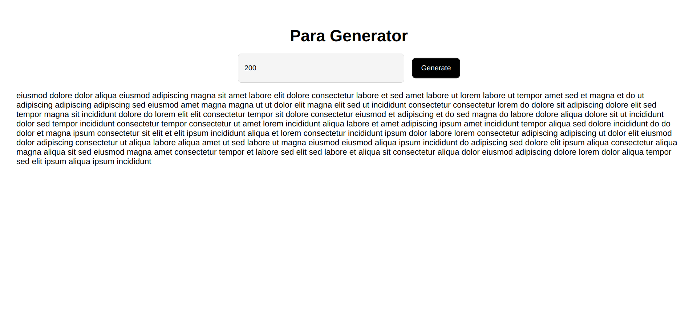

# Paragraph Generator

Paragraph Generator is a React-based web application designed to generate random paragraphs. This tool is perfect for designers, developers, and writers who need placeholder text for testing or layout purposes. Built with React and Vite, it offers a fast and efficient way to create paragraphs on the fly.

## Features

- Generate random paragraphs with a single click.
- Customize the size of the paragraph generated.
- Fast and responsive design.

## Getting Started

To get a local copy up and running follow these simple steps.

### Prerequisites

- npm

### Installation

1. Clone the repo
```bash
git clone https://github.com/nimeshthakur0/paragraph-generator.git
```
2. Install NPM packages
```bash
npm install
```
3. Run the application
```bash
npm run dev
```

## Usage

To use the Paragraph Generator, simply:

1. Enter the number of words you want in your paragraph.
2. Click the "Generate" button.
3. The paragraph will be displayed on the screen.

## Screenshots



## Built With

- [React](https://reactjs.org/) - The web framework used
- [Vite](https://vitejs.dev/) - Build tool for a faster and leaner development experience

## License

Distributed under the MIT License. See `LICENSE` for more information.

## Contact

Nimesh Thakur - nimeshthakur0@gmail.com

Project Link: [https://github.com/nimeshthakur0/paragraph-generator](https://github.com/nimeshthakur0/paragraph-generator)
